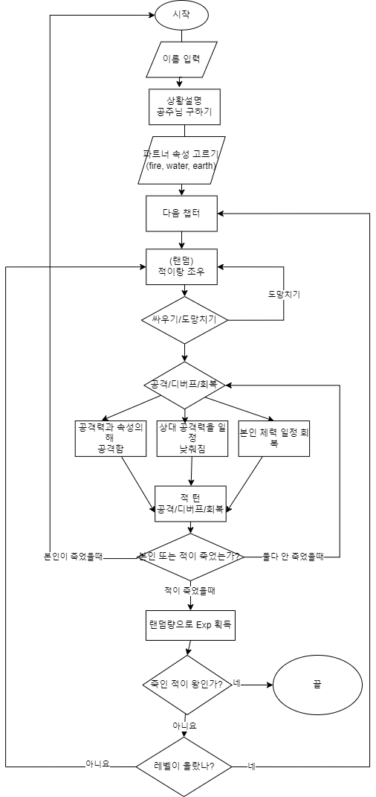

# 🏰 Quest of Eldoria (공주님 구하기 게임) 🏹

## 📖 프로젝트 개요  
이 게임은 턴제 방식으로 진행되는 **전략 RPG 게임**입니다. 플레이어는 용사가 되어 **납치된 공주를 구출**하기 위한 여정을 떠납니다.  
여러 개의 스테이지를 클리어하면서 강력한 적들과 전투를 벌이고, 스킬(공격, 디버프, 회복)을 활용하여 전략적으로 승리해야 합니다.  

---

## 🎮 게임 특징  
- **턴제 전투 시스템** – 공격, 디버프, 힐 등의 전략적 선택이 필요  
- **타입 상성 시스템** – 불, 물, 대지 속성이 존재하며 상성을 고려한 전투 필수  
- **단계별 스토리 진행** – 숲, 다리, 성 등에서 점점 강력한 적들과 전투  
- **보스 전투** – 최종 보스와의 치열한 결투  
- **시크릿 전투 모드** – 게임 클리어 후 **시크릿** 모드로 다른 게임모드 가능  

---
## 📝 공지
- 모든 몬스터, 플레이어의 체력, 공격력은 렌덤입니다. 
- 공격력 n 은 최대 n만큼 공격한다는 뜻입니다.
- 저작권은 사이트에 각각 확인했습니다. 그래도 문제가 되면 말씀해주세요!
- 한국어 버전에 주석이 추가했습니다. 챗지피티가 번역을 해서 오역 주의 바랍니다.
- **(영어 원본을 추천 드립니다.)**
---
## 🔧 설치 방법  
- py. 파일을 터미널 대신 IDE 실행 부탁드립니다.
- 만약에 터미널로 실행하실시엔 에러 메세지와 오류가 떠서 진행이 안됩니다. 
```bash
# 1. 저장소 클론
git clone https://github.com/100-hours-a-week/2-lillian-rhee-quest-of-eldoria.git

# 2. 프로젝트 폴더 이동
cd 2-lillian-rhee-quest-of-eldoria/src

# 3. 프로젝트 실행
python quest_of_eldoria.py
```
---
## 🔹 추가 사항:
1. **스토리 기반 설명 추가** – "Quest of Eldoria"로 이름 설정.
2. **게임의 주요 특징 정리** – 턴제 전투, 속성 상성, 보스전, 무한 모드 설명.
3. **설치 및 실행 방법** – Python으로 실행하는 방식 명시.
4. **게임 방법** – 플레이어 진행 방식 및 전투 선택지 추가.

## 🖼️ 스크린샷  
### 🎭오프닝
 

### 🌲챕터 별 소개

 

### 🏹 전투 화면  
  

---
## 📜 플로우차트
-개발 초기 로직을 볼수있습니다.
  
---
